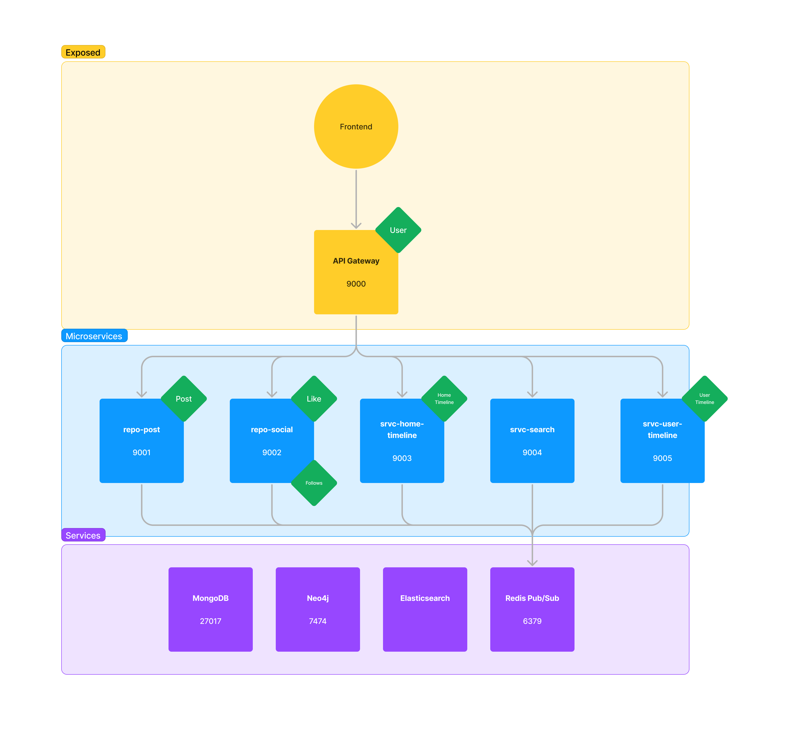
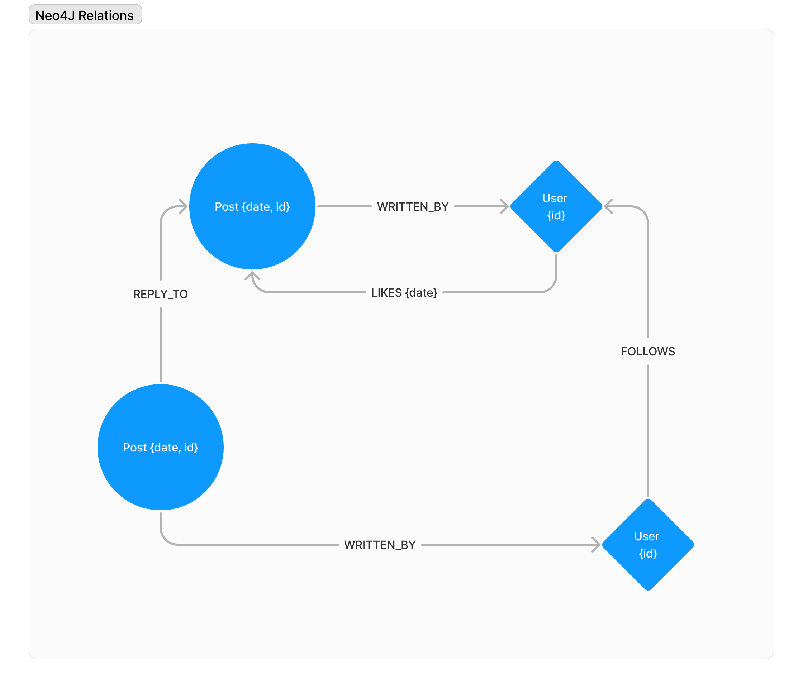

# TinyX

## Architecture
The project is divided into 5 microservices, each one having its own database. The communication between the microservices is done through REST API. The microservices are :
- repo-post
- repo-social
- srvc-home-timeline
- srvc-search
- srvc-user-timeline

There is also a library called tinyx-lib that contains all the DTO, entities, exceptions... that are used in the microservices.

To finish, there is a gateway that is used to access the microservices. It is the only entry point to the microservices.

[](architecture.png)

The Neo4j database is used to store the social relations between the users. Here is the schema of the database :
[](neo4j.png)

## Kubernetes deployment
Everything has been thought to be deployed easly on a Kubernetes cluster.
Requirements :
    - kubectl configured to access your cluster
    - helm to install CRD in the cluster

```
# To create a secret to pull image from the repository
kubectl create secret docker-registry tinyx-pull-secret  --docker-server=registry.cri.epita.fr/charles.simon-meunier/
--docker-username=<your-name> --docker-password=<your-pword> --docker-email=<your-email>

```

```
# to install everything necessary and deploy use this script
./helm_installation.sh
```


## Services

| Service            | Port | URL                   |
|--------------------|------|-----------------------|
| repo-post          | 9001 | http://localhost:9001 |
| repo-social        | 9002 | http://localhost:9002 |
| srvc-home-timeline | 9003 | http://localhost:9003 |
| srvc-search        | 9004 | http://localhost:9004 |
| srvc-user-timeline | 9005 | http://localhost:9005 |

## Features

### tinyx-lib
Library that contains all declaration of DTO, entities, exceptions...

To be used in other microservices, first install the library.
```
cd tinyx
mvn clean install
```

### repo-post
- [X] User can create a post
- [X] Post can contain text, a media, a repost. At least one of, at most two of
- [X] Post can be a reply to another post
- [X] Reposts and replies need to point to an existing post at the time of creation
- [X] Reposts and replies cannot point to a post from a blocked user at the time of creation
- [X] User can delete its own post
- [X] Can query a user’s posts
- [X] Can query a specific post
- [X] Can query a specific post’s reply

### repo-social
- [X] User can like/unlike a post from a user who doesn’t have a block relationship with them
- [X] Likes should be dated to allow proper sorting in timeline services (currently using the
post’s post date instead)
- [X] User can follow/unfollow a user who doesn’t have a block relationship with them
- [X] User can block/unblock a user
- [X] Blocking a user removes follow relations between these users (asynchronously ?)
- [X] Can query a post’s liking users
- [X] Can query a user’s liked posts
- [X] Can query a user’s follows
- [X] Can query a user’s followers
- [X] Can query a user’s block list
- [X] Can query the list of users who blocked a user

### srvc-search
- [X] Created posts are indexed
- [X] Deleted posts are removed from the index
- [X] If regular words are in the search terms, results must contain AT LEAST ONE of the
searched words (vague search).
- [X] If hashtags are in the search terms, results must include ALL of the searched hashtags (strict
search)
- [X] If both words and hashtags are in the search terms, results must fulfill BOTH rules above
at once
- [X] A hashtag word should not be matched as a regular word, only as a hashtag (e.g. searching
“word” should not find “#word”)

### srvc-user-timeline
- [X] Get a list of posts related to a specific user, containing
- [X] Posts authored by the user
- [X] Posts liked by the user (It is currently inferred that if a post’s authorID does not match
the timeline’s ID it means the post is liked)
- [X] Sorted in chronological order (in case of likes, the date of like is used, not the date of
post post)
- [X] Asynchronously update the timeline whenever a post is created/deleted/liked/unliked for
said user

### srvc-home-timeline
- [X] Get a list of posts related to a specific user’s follows, containing
- [X] posts authored by users followed by the user (bonus: second-degree follows ?)
- [X] posts liked by users followed by the user (bonus: second-degree follows ?)
- [X] Timeline must contain the information of which user liked the post as we cannot
just rely on the timeline owner’s ID this time
- [X] Sorted in chronological order (in case of likes, the date of like is used, not the date of
post post)
- [X] Duplicates are allowed (if multiple users like the same post)
- [X] Asynchronously update the timeline whenever a post is created/deleted/liked/unliked for
users followed by the user
- [X] Asynchronously update the timeline whenever a user is followed/unfollowed by the user
Essentially a merging of all user timelines of users followed by the querying user
